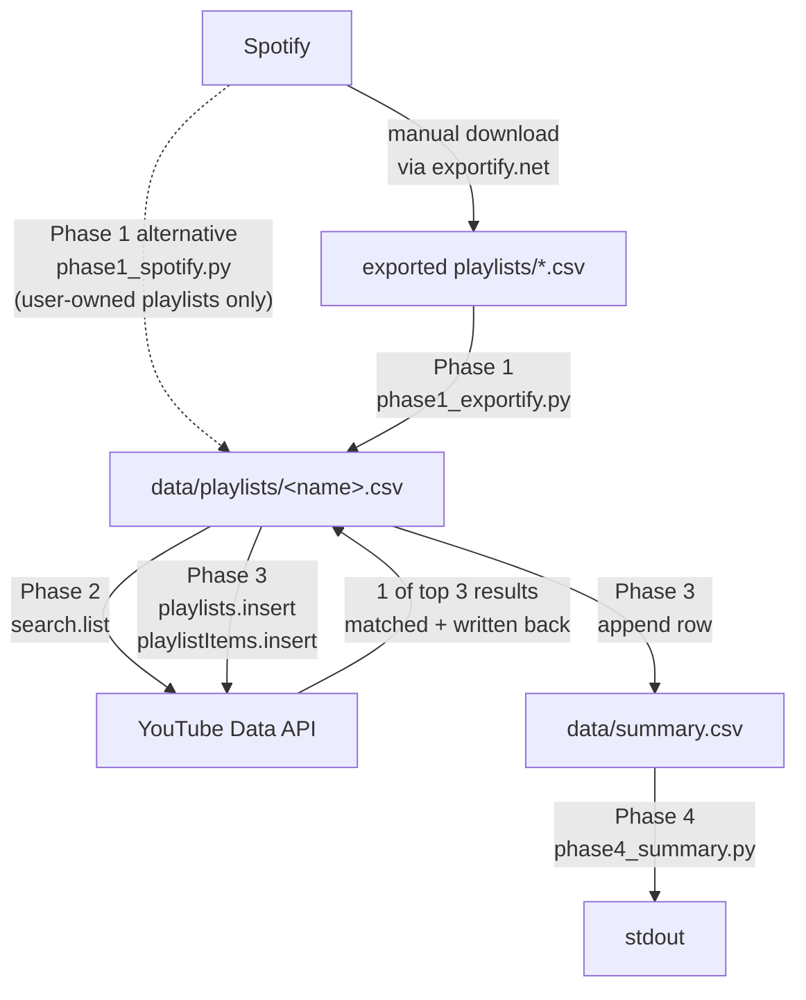

# Code Architecture

**Contents**

- [Overview](#phase-overview)
- [Utilities](#shared-utilities)
- [Phase 1 alternatives](#phase-1-alternatives)
- [Resumability](#resumability-and-quota)
- [Data flow](#data-flow)

The pipeline is structured as four discrete phases. Each phase is a standalone script in [`scripts/`](../scripts/) that reads from and writes to files on disk — no in-memory state is shared across phases. This makes every step resumable: re-running a phase skips rows that already have output.

## Phase overview

| Phase | Script | Purpose | Reads | Writes |
|-------|--------|---------|-------|--------|
| 1 | [`phase1_exportify.py`](../scripts/phase1_exportify.py) | Import Spotify playlists from Exportify CSVs into pipeline format | `exported playlists/*.csv` | `data/playlists/<name>.csv` |
| 2 | [`phase2_yt_search.py`](../scripts/phase2_yt_search.py) | For each track, find the best matching YouTube video | `data/playlists/<name>.csv` | Same file, with `YouTube URL` populated |
| 3 | [`phase3_yt_playlist.py`](../scripts/phase3_yt_playlist.py) | Create an Unlisted YouTube playlist and add matched videos | `data/playlists/<name>.csv` | YouTube (via API), `data/summary.csv` |
| 4 | [`phase4_summary.py`](../scripts/phase4_summary.py) | Print master summary table | `data/summary.csv` | stdout |

A wrapper, [`scripts/run_pipeline.py`](../scripts/run_pipeline.py), invokes Phases 1–3 in sequence for one or more playlists.

## Shared utilities

The [`utils/`](../utils/) package contains modules each phase pulls from:

| Module | Responsibility |
|--------|----------------|
| [`csv_ops.py`](../utils/csv_ops.py) | Read/write pipeline CSVs |
| [`cli.py`](../utils/cli.py) | Interactive and `--playlist`-driven playlist selection (case-insensitive) |
| [`matching.py`](../utils/matching.py) | Normalization, song/title comparison, strictness levels — see [Video Matching](Video%20Matching.md#video-matching) |
| [`rate_limit.py`](../utils/rate_limit.py) | YouTube quota tracking, persistence across runs via `data/quota_state.json` |
| [`youtube_auth.py`](../utils/youtube_auth.py) | YouTube OAuth client construction; surfaces a helpful message when `token.json` is expired |
| [`spotify_auth.py`](../utils/spotify_auth.py) | Spotify PKCE client (used only by `phase1_spotify.py`) |

## Phase 1 alternatives

Three Phase 1 implementations exist, only one of which is the supported entry point:

- **`phase1_exportify.py`** — Primary. Reads Exportify CSV exports. Works for any Spotify playlist regardless of owner.
- **`phase1_spotify.py`** — Reads playlists directly via the Spotify Web API. Limited to playlists owned by the authenticated user under Spotify's 2024 API rules. See [Playlist Access](Playlist%20Access.md#playlist-access--spotifys-2024-api-restrictions).
- **`phase1_musicleague.py`** — Attempted Music League API integration; endpoints were found to be deprecated. Kept as a historical reference.

## Resumability and quota

Every phase that touches a CSV reads the entire file first and **skips rows that already have downstream output** (e.g. Phase 2 skips rows where `YouTube URL` is already set; 
Phase 3 skips videos already added to the YouTube playlist). 
This means it is always safe to re-run a phase, whether you stopped intentionally or hit a quota cutoff. 
*Delete data in appropriate columns to redo actions*.

YouTube quota is tracked in `data/quota_state.json` and **persists across runs on the same day**, automatically resetting on a new UTC day. A partial run that consumed 3,000 units leaves 6,000 for subsequent runs that day — no manual bookkeeping required.

## Data flow

### Mermaid

The solid arrows show the primary Exportify-based flow. The dashed arrow shows the [Phase 1 alternative](#phase-1-alternatives) — `phase1_spotify.py` reads directly from the Spotify API and writes pipeline CSVs without an Exportify intermediate (user-owned playlists only).

